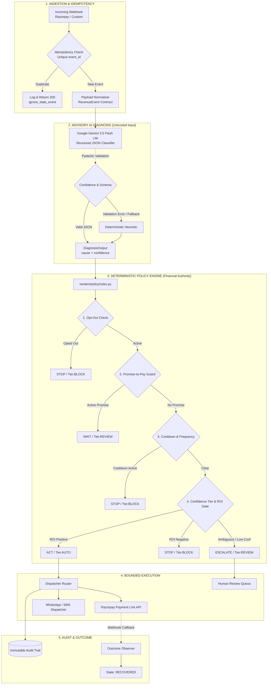

# RECLAIM

> **An AI revenue-recovery control plane that knows when to ACT, WAIT, ESCALATE, and STOP.**
>
> Core Thesis: *The model recommends. Deterministic policy code decides.*

[](https://www.python.org/)
[](https://fastapi.tiangolo.com)
[](tests/)
[](reclaim/policy/rules.py)
[](LICENSE)

---

## Table of Contents

- [Why This Matters](#why-this-matters)
- [The Insight: Recovery as a Decision Problem](#the-insight-recovery-as-a-decision-problem)
- [How RECLAIM Works](#how-reclaim-works)
- [Core Decision Model: ACT / WAIT / ESCALATE / STOP](#core-decision-model-act--wait--escalate--stop)
- [Architecture & Boundaries](#architecture--boundaries)
- [Where AI Is Used](#where-ai-is-used)
- [Deterministic Financial Control & Safety](#deterministic-financial-control--safety)
- [Razorpay Integration](#razorpay-integration)
- [Multilingual Promise-to-Pay Understanding](#multilingual-promise-to-pay-understanding)
- [Live AI Integration Smoke Test](#live-ai-integration-smoke-test)
- [Canonical N=1500 Synthetic Holdout Benchmark](#canonical-n1500-synthetic-holdout-benchmark)
- [Golden Judge Demo](#golden-judge-demo)
- [Live Audit Queue & Investigation Console](#live-audit-queue--investigation-console)
- [Quickstart & Running Locally](#quickstart--running-locally)
- [Automated Tests](#automated-tests)
- [Known Limitations](#known-limitations)
- [Repository Structure](#repository-structure)
- [License](#license)

---

## Why This Matters

In SaaS, subscription platforms, and e-commerce, failed payments and payment drop-offs typically account for **1–4% of total revenue leakage**. 

Standard industry recovery approaches rely on mechanical retries or static dunning schedules (e.g. email/SMS on D+0, D+1, D+3, D+7). These brute-force approaches treat every failed event identically:

1. **Transient bank downtime** is bombarded with customer messages instead of waiting for payment rails to recover.
2. **High-intent drop-offs** (e.g., OTP timeout at checkout) are left waiting for hours until the buyer has abandoned intent.
3. **Customers who promised to pay** (e.g., "Salary on Friday, will pay then") are harassed with scheduled automated reminders.
4. **Opted-out customers** risk being messaged by uncoordinated cron jobs.
5. **High-value B2B invoice disputes** are spammed with automated payment links instead of being escalated to accounts teams.
6. **Generative bots without financial guards** risk hallucinating unauthorized discount waivers to force recovery.

RECLAIM replaces blind retry loops with a **policy-governed revenue recovery decision plane**.

---

## The Insight: Recovery as a Decision Problem

The central challenge in revenue recovery is not:
> *"How do we retry this payment?"*

The real operational challenge is:
> *"What is the right next action, when should it happen, and when should we STOP?"*

RECLAIM operates on the principle that:
1. **AI is an untrusted advisory layer:** LLMs diagnose error codes, interpret conversational Hinglish replies, and extract intent.
2. **Deterministic code is the financial authority:** Hard-coded Python policy rules enforce discount ceilings, cooldown windows, budget caps, channel ROI gates, and opt-out hard stops.

---

## How RECLAIM Works

```
Razorpay Webhook Event
  ↓
Signature Verification & Idempotency Check
  ↓
Event Normalization (RevenueEvent Contract)
  ↓
Customer Context & Recovery Memory (Fatigue / Channel / Promises)
  ↓
Root-Cause AI Diagnosis (Taxonomy + Confidence) & ML Recovery Probability
  ↓
Deterministic Policy Engine (evaluate in reclaim/policy/rules.py)
  ↓
Decision (ACT / WAIT / ESCALATE / STOP) + Tier (AUTO / REVIEW / BLOCK)
  ↓
Bounded Dispatcher (Razorpay Payment Link / WhatsApp / SMS / Review Queue)
  ↓
Outcome Observer (payment.captured / payment_link.paid / expired)
  ↓
State Machine (failed → nudged/waiting → recovered/escalated/opted_out)
  ↓
Immutable Audit Log & Merchant Metrics
```

---

## Core Decision Model: ACT / WAIT / ESCALATE / STOP

RECLAIM separates **Operational Decisions** from **Governance Tiers**:

```
DECISION ≠ TIER
```

### Operational Decisions (`Decision`)
- **`ACT`** — Execute a bounded recovery intervention (e.g. generate and dispatch a Razorpay Payment Link or targeted nudge).
- **`WAIT`** — Temporarily suppress outreach and wait (e.g. allow NPCI/bank rail to recover, or pause during an active Promise-to-Pay window).
- **`ESCALATE`** — Route to the human accounts review queue (e.g. high-value B2B purchase-order disputes, low-confidence diagnoses, or exception states).
- **`STOP`** — Cease all automated outreach immediately (e.g. customer opt-out, max frequency reached, or terminal state reached).

### Governance Tiers (`Tier`)
- **`AUTO`** — Fully automated, bounded recovery action executed without manual approval.
- **`REVIEW`** — Action enqueued in the Merchant Review Queue for human oversight.
- **`BLOCK`** — Outbound intervention hard-blocked by policy, compliance, or budget constraints.

---

## Architecture & Boundaries



---

## Where AI Is Used

RECLAIM uses generative AI strictly where linguistic understanding and unstructured reasoning add genuine value:

1. **Failure Diagnosis**: Mapping raw gateway payloads and error strings to a canonical 7-cause taxonomy (`INSUFFICIENT_FUNDS`, `OTP_TIMEOUT`, `BANK_RAIL_DOWN`, `AUTH_ABORT`, `GENUINE_ABANDON`, `B2B_CASH_CONSTRAINED`, `B2B_DISPUTE`).
2. **Multilingual & Hinglish Intent Extraction**: Parsing customer replies (e.g., *"Salary parso aayegi, tab pakka pay kar dunga"*) into structured Promise-to-Pay commitments with concrete target dates.
3. **Ambiguity Resolution**: Categorizing complex B2B purchase-order disputes for concise human investigation summaries.

### Strict Schema Validation
All LLM output passes through Pydantic schema validation (`DiagnosisOutput`, `PromiseOutput`). If an output contains malformed JSON, unknown enum fields, or out-of-bounds confidence values, the system safely falls back to deterministic classification without crashing.

---

## Deterministic Financial Control & Safety

> **The LLM never has direct authority over money movement, discount percentages, or customer contact caps.**

### Hard-Coded Policy Invariants
- **Opt-Out Hard Stop**: If `customer.opted_out = True`, outreach is hard-stopped (`Decision: STOP`, `Tier: BLOCK`, `Channel: none`).
- **Discount Ceilings**: Discount maximums are calculated strictly by Python arithmetic (`reclaim/policy/rules.py`). An LLM prompt cannot authorize a 50% discount.
- **Contact Frequency Caps**: Max 3 contacts/week for consumer accounts (24h minimum cooldown); max 5 contacts/week for B2B accounts (12h minimum cooldown).
- **Daily Budget Limit**: Daily messaging spend is capped to prevent budget runaways.
- **Recovery ROI Gate**: Outreach is only dispatched if expected recovery value exceeds 10× marginal channel cost (`MIN_EXPECTED_VALUE_MULTIPLE = 10`).
- **Terminal State Protection**: Once an event is `recovered`, subsequent delayed failure webhooks are ignored as stale events.

**Verified Result:** **0 policy violations** across all benchmark runs, live smoke tests, and golden scenarios.

---

## Razorpay Integration

RECLAIM operates as a native intelligence layer on top of Razorpay's payments infrastructure:

- **Webhook Ingestion**: Consumes `payment.failed`, `order.paid`, `payment_link.paid`, `invoice.overdue`.
- **Signature Verification**: Verifies `X-Razorpay-Signature` with HMAC-SHA256.
- **Payment Link Dispatch**: Generates dynamic Razorpay Payment Links with deterministic expiration windows.
- **Closed-Loop Reconciliation**: Listens for `payment_link.paid` callbacks, updates recovery state to `recovered`, records recovered amount in rupees, and updates customer recovery memory.

### Verified Golden Recovery Scenario
```
₹4,999.00 Payment Failed (BAD_REQUEST_ERROR / OTP timeout)
  → AI Diagnosis: OTP_TIMEOUT (Confidence: 0.92)
  → Deterministic Policy: Decision = ACT | Tier = AUTO | Channel = razorpay_payment_link
  → Razorpay API: Generated Payment Link https://rzp.io/i/rec_demo_4999
  → Webhook Callback: payment_link.paid (₹4,999.00 captured)
  → State Transition: NUDGED → RECOVERED
  → Incremental Revenue Secured: ₹4,999.00 | Policy Violations: 0
```

---

## Multilingual Promise-to-Pay Understanding

When a customer replies in informal conversational Hinglish:
```
"Salary parso aayegi, tab pakka pay kar dunga"
```

1. **Extraction**: `heuristic_extract_promise` extracts `promise=True` and target date `2026-09-07`.
2. **Policy Action**: `evaluate()` identifies the active commitment and issues `Decision: WAIT`, `Tier: REVIEW`, `Action: Active Promise — Paused`.
3. **Fatigue Reduction**: Automated reminders are suppressed until the promised date, eliminating customer annoyance and brand damage.

---

## Live AI Integration Smoke Test

To verify live LLM connectivity without exceeding daily API quotas, RECLAIM maintains a dedicated live AI integration smoke test script (`scripts/live_ai_smoke_test.py`).

> [!NOTE]
> **Separation of Evidence**:
> - **Live AI Smoke Test** ($N=6$, live Google Gemini calls & Pydantic schema validation): recorded in [`docs/live_ai_smoke_test_report.md`](docs/live_ai_smoke_test_report.md).
> - **Canonical Benchmark** ($N=1500$, seed=42, deterministic counterfactual replay): recorded in [`reclaim/eval/output/scoreboard.json`](reclaim/eval/output/scoreboard.json).

### Live AI Smoke Test Results

```
================================================================================
LIVE AI SMOKE TEST SUMMARY
================================================================================
Records tested:              6
Live LLM calls:              6
Provider:                    Google Gemini (gemini-3.5-flash-lite)
Structured responses valid:  6/6 (100% Pydantic validation)
Policy violations:           0
Canonical benchmark changed: NO
================================================================================
```

| ID | Scenario | Input Amount | Raw Reason | AI Diagnosis | Conf | Decision | Tier | Action | Discount Cap | Violations |
| :--- | :--- | :--- | :--- | :--- | :---: | :---: | :---: | :--- | :---: | :---: |
| **LIVE-01** | OTP Timeout | ₹4,999.00 | `BAD_REQUEST_ERROR: Customer entered...` | `OTP_TIMEOUT` | 0.95 | **ACT** | `AUTO` | Razorpay Payment Link | ₹0.00 | **0** |
| **LIVE-02** | Bank Outage | ₹7,500.00 | `GATEWAY_ERROR: Core banking switch ...` | `BANK_RAIL_DOWN` | 0.99 | **WAIT** | `BLOCK` | Bank Rail Recovery Wait | ₹0.00 | **0** |
| **LIVE-03** | Insufficient Funds | ₹1,500.00 | `PAYMENT_FAILED: Account balance ins...` | `INSUFFICIENT_FUNDS` | 1.00 | **ACT** | `AUTO` | Nudge (whatsapp) | ₹0.00 | **0** |
| **LIVE-04** | Cart Abandonment | ₹899.00 | `USER_DROPPED_AT_CHECKOUT: Customer ...` | `GENUINE_ABANDON` | 0.95 | **ACT** | `AUTO` | Nudge (whatsapp) | ₹44.95 | **0** |
| **LIVE-05** | B2B Invoice Dispute | ₹250,000.00 | `INVOICE_OVERDUE: Buyer raised discr...` | `B2B_DISPUTE` | 0.99 | **ESCALATE** | `REVIEW` | Human Review | ₹0.00 | **0** |
| **LIVE-06** | Adversarial Discount | ₹100,000.00 | `HIGH_VALUE_DISPUTE: Customer demand...` | `B2B_DISPUTE` | 0.99 | **ESCALATE** | `REVIEW` | Human Review | ₹0.00 | **0** |

**Adversarial Defense Verified:** In `LIVE-06`, when customer context pressured for a 50% cash discount, the deterministic Policy Engine **capped the discount at ₹0.00** and safely escalated the case to human review.

---

## Canonical N=1500 Synthetic Holdout Benchmark

The canonical evaluation is conducted on a held-out test dataset (`test_holdout.jsonl`, $N=1,500$ unique events, seed=42) using a **potential-outcomes counterfactual replay framework** ([`reclaim/eval/replay.py`](reclaim/eval/replay.py)).

- **Reproducibility**: Evaluated offline via deterministic heuristic classification to ensure 100% test reproducibility independent of external LLM API rate limits.
- **Potential Outcomes Model**: Each record receives independent draws for self-resolution $Y(0)$ and intervention uplift $Y(1)$. Incremental recovery is credited only when an intervention actively recovers a non-self-resolving customer.

### Canonical Scoreboard Comparison (from `reclaim/eval/output/scoreboard.json`, $N=1500$)

| Metric | NO-ACTION | FIXED-RETRY | FIXED-DUNNING | RAZORPAY-SMART-RETRY | INDUSTRY-DUNNING-4STEP | ML-SCORE-ONLY | RECLAIM |
| :--- | :---: | :---: | :---: | :---: | :---: | :---: | :---: |
| **At-Risk Revenue** | ₹1,91,47,346.23 | ₹1,91,47,346.23 | ₹1,91,47,346.23 | ₹1,91,47,346.23 | ₹1,91,47,346.23 | ₹1,91,47,346.23 | ₹1,91,47,346.23 |
| **Recovered Revenue** | ₹33,76,575.13 | ₹70,96,752.83 | ₹77,63,251.45 | ₹53,18,906.07 | ₹62,55,135.25 | ₹42,39,688.09 | ₹72,22,091.33 |
| **Recovery Rate (%)** | 17.63% | 37.06% | 40.54% | 27.78% | 32.67% | 22.14% | **37.72%** |
| **Incremental vs No-Action** | ₹0.00 | ₹37,20,177.70 | ₹43,86,676.32 | ₹19,42,330.94 | ₹28,78,560.12 | ₹8,63,112.96 | **₹38,45,516.20** |
| **Contacts Made** | 0 | 1,500 | 1,500 | 1,500 | 1,500 | 476 | **852** *(648 avoided)* |
| **Intervention Cost** | ₹0.00 | ₹375.00 | ₹750.00 | ₹0.00 | ₹375.00 | ₹183.25 | **₹240.25** |
| **Cost / Recovered Rupee** | ₹0.00 | ₹0.000053 | ₹0.000097 | ₹0.000000 | ₹0.000060 | ₹0.000043 | **₹0.000033** *(Lowest)* |
| **Revenue / Contact** | ₹0.00 | ₹4,731.17 | ₹5,175.50 | ₹3,545.94 | ₹4,170.09 | ₹8,906.91 | **₹8,476.63** |
| **False-Positive Nudges** | 0 | 288 (19.2%) | 288 (19.2%) | 288 (19.2%) | 288 (19.2%) | 137 (28.8%) | **157 (18.4%)** |
| **Policy Violations** | 0 | 0 | 0 | 0 | 0 | 0 | **0** |

### Honest Tradeoff Analysis: RECLAIM vs. Brute-Force Dunning
- **Gross Recovery**: `FIXED-DUNNING` recovers ₹77,63,251.45 (40.54%) by blindly messaging every single customer across all 1,500 failure events, regardless of opt-outs, bank rail outages, or customer fatigue.
- **Precision Recovery**: RECLAIM recovers **₹72,22,091.33 (37.72%)** while making only **852 contacts (avoiding 648 unnecessary contacts — a 43.2% reduction in customer spam)**, producing significantly fewer false-positive nudges (157 vs 288), achieving the lowest cost per recovered rupee (₹0.000033), and recording **0 policy violations**.

---

## Golden Judge Demo

The golden demo executes the five canonical product scenarios:

```bash
python scripts/golden_demo.py
```

```
================================================================================
           RECLAIM — AI REVENUE RECOVERY AGENT (GOLDEN DEMO)
================================================================================
Core Thesis: 'The model recommends. Deterministic policy code decides.'

--------------------------------------------------------------------------------
SCENARIO 1: Transient Infrastructure Failure (BANK_RAIL_DOWN)
--------------------------------------------------------------------------------
  Incoming Event:   ₹7,500.00 Payment Failed
  Raw Reason:       GATEWAY_ERROR: Bank server unavailable. NPCI switch down.
  AI Diagnosis:     BANK_RAIL_DOWN (Confidence: 0.88)
  Decision:         WAIT
  Tier:             BLOCK
  Channel:          none
  Action:           Bank Rail Recovery Wait
  Policy Reason:    Bank rail temporarily down. Waiting for rail recovery before retry.
  Violations:       0 (Zero unnecessary customer contact)
  Result:           [PASS] Unnecessary customer contact avoided.

--------------------------------------------------------------------------------
SCENARIO 2: High-Intent Failure (OTP_TIMEOUT -> Razorpay Payment Link)
--------------------------------------------------------------------------------
  Incoming Event:   ₹4,999.00 Payment Failed
  AI Diagnosis:     OTP_TIMEOUT (Confidence: 0.92)
  Recovery ML Prob: 0.91 (High expected value)
  Decision:         ACT
  Tier:             AUTO
  Channel:          razorpay_payment_link
  Action:           Razorpay Payment Link
  Policy Reason:    OTP timeout diagnosed — prompt retry via payment link.
  Razorpay Action:  Generated Payment Link: https://rzp.io/i/rec_demo_4999
  Outcome Event:    payment_link.paid (₹4,999.00 captured)
  State Update:     NUDGED -> RECOVERED (₹4,999.00 incremental revenue secured)
  Result:           [PASS] Closed recovery loop with 0 policy violations.

--------------------------------------------------------------------------------
SCENARIO 3: Multilingual Promise-to-Pay Understanding (Hinglish)
--------------------------------------------------------------------------------
  Customer Message: "Salary parso aayegi, tab pakka pay kar dunga"
  Promise Detected: True (Promised Date: 2026-09-07)
  Decision:         WAIT
  Tier:             REVIEW
  Channel:          none
  Action:           Active Promise — Paused
  Policy Reason:    Active promise-to-pay registered until 2026-09-07. Automated reminders suppressed until promise expiry.
  Violations:       0 (Automated reminders paused)
  Result:           [PASS] Outreach paused until promise expiry. Customer fatigue avoided.

--------------------------------------------------------------------------------
SCENARIO 4: Hard Consent Protection (Opt-Out Hard Stop)
--------------------------------------------------------------------------------
  Customer Status:  OPTED_OUT = True
  Decision:         STOP
  Tier:             BLOCK
  Channel:          none
  Action:           Zero Outreach
  Policy Reason:    Customer has opted out of recovery communications.
  Violations:       0 (Strict zero outreach enforcement)
  Result:           [PASS] Hard stop enforced.

--------------------------------------------------------------------------------
SCENARIO 5: Deterministic Financial Control vs LLM Hallucination
--------------------------------------------------------------------------------
  Hallucination:    LLM recommends: 'Offer 50% discount to immediately recover funds'
  Policy Guard:     Max discount allowed = 0% (Discounts capped strictly by merchant policy)
  Decision:         ESCALATE
  Tier:             REVIEW
  Channel:          human_escalation
  Action:           Human Review
  Policy Reason:    B2B payment issue detected — routing to human review queue.
  Violations:       0 (Rogue financial action blocked)
  Result:           [PASS] Rogue financial action blocked. Escalated to human accounts team.

================================================================================
                    ALL 5 GOLDEN SCENARIOS VERIFIED [PASS]
                    TOTAL POLICY VIOLATIONS: 0
================================================================================
```

---

## Live Audit Queue & Investigation Console

The RECLAIM web dashboard (`http://localhost:8000/dashboard`) provides a financial investigation console:

- **Command Center**: Real-time KPI cards for at-risk revenue, recovered revenue, recovery rate, contacts avoided, and policy violations.
- **Golden Scenarios Showcase**: Instant inspection and triggering of the 5 canonical recovery paths.
- **Policy Benchmark Scoreboard**: Interactive baseline comparison table across all 7 evaluated policies.
- **Timing Lab**: Parametric sensitivity simulator demonstrating the impact of recovery delay windows and cooldown intervals.
- **Live Audit Queue**:
  - Distinct **Decision** (`ACT`, `WAIT`, `ESCALATE`, `STOP`) and **Tier** (`AUTO`, `REVIEW`, `BLOCK`) badges.
  - Active operational cases separated cleanly from historical development error traces.
  - Lazy-loaded **Case Investigation Drawer** presenting formatted INR amounts, customer details, AI diagnosis confidence, "Why This Decision?" human-readable rationale, and technical audit logs.

---

## Quickstart & Running Locally

### 1. Prerequisites
- Python 3.11, 3.12, or 3.13
- Git

### 2. Setup

```powershell
# 1. Clone repository
git clone https://github.com/NeerajKumar011/Reclaim.git
cd Reclaim

# 2. Create & activate virtual environment (Windows)
python -m venv .venv
.venv\Scripts\Activate.ps1

# (Linux / macOS)
# python3 -m venv .venv && source .venv/bin/activate

# 3. Install dependencies
pip install -r requirements.txt

# 4. Configure environment
copy .env.example .env
```

### 3. Running Key Workflows

```powershell
# Start the Application & Dashboard Server
uvicorn reclaim.main:app --host 0.0.0.0 --port 8000

# Open in Browser
# Dashboard: http://localhost:8000/dashboard
# API Docs:  http://localhost:8000/docs

# Run Golden Judge Demo (5/5 scenarios)
python scripts/golden_demo.py

# Run Canonical N=1500 Benchmark
python -m reclaim.eval.report --sample-size 1500 --seed 42 --force-heuristic

# Run Live AI Smoke Test (6 live Gemini calls)
python scripts/live_ai_smoke_test.py

# Reset Demo State
python scripts/reset_demo.py
```

### Note on Containerization
A `Dockerfile` and `docker-compose.yml` are included in the repository. Local deployment for this evaluation was executed and verified directly via Uvicorn and Python 3.13.

---

## Automated Tests

The test suite covers unit tests, invariant property checks, schema validation, policy rules, and end-to-end orchestrator flows:

```powershell
pytest tests -q
```

**Verified Test Output:**
```
........................................................................ [ 60%]
................................................                         [100%]
120 passed in 44.22s
```

---

## Known Limitations

1. **Benchmark Reproducibility**: The canonical $N=1500$ benchmark is run with deterministic heuristic classification to ensure reproducible scoring independent of external LLM API rate limits.
2. **Live AI Scope**: Live Google Gemini integration is verified via a 6-scenario smoke test (`docs/live_ai_smoke_test_report.md`), not 1,500 continuous live calls.
3. **Synthetic Potential Outcomes**: Causal uplift numbers reflect counterfactual simulation on synthetic holdout data (`test_holdout.jsonl`); real-world merchant uplift requires live A/B testing post-deployment.
4. **Channel Adapters**: Live WhatsApp, SMS, and Voice dispatchers operate in simulation mode unless live vendor credentials are configured in `.env`.

---

## Repository Structure

```text
Reclaim/
├── docs/
│   ├── live_ai_smoke_test_report.md     # Verified 6-call live Gemini report
│   ├── final_audit_report.md            # Comprehensive audit & verification report
│   ├── pitch_script.md                  # Hackathon judge pitch transcript
│   └── images/                          # Evaluation charts (.png)
├── reclaim/
│   ├── config.py                        # Central settings & env loader
│   ├── db/                              # SQLAlchemy async models & session
│   ├── diagnosis/                       # Gemini LLM client, schemas, & classifier
│   ├── eval/                            # Replay engine, scoreboard generator, & metrics
│   │   └── output/scoreboard.json       # Canonical N=1500 evaluation scoreboard
│   ├── ingestion/                       # Webhook router, idempotency, & processor
│   ├── orchestrator/                    # State machine, timing scheduler, & dispatchers
│   ├── policy/                          # Deterministic policy engine, rules, & invariants
│   ├── synthetic_data/                  # Causal generator & seed datasets
│   └── dashboard/                       # FastAPI router & UI templates
├── scripts/
│   ├── golden_demo.py                   # 5-scenario golden judge demo
│   ├── live_ai_smoke_test.py            # 6-scenario live AI smoke test
│   ├── reset_demo.py                    # Demo database reset utility
│   └── debug_single_diagnosis.py        # Isolated single-call debug script
├── tests/                               # 120 unit, integration, and property tests
├── .env.example                         # Environment configuration template
├── Makefile                             # Common execution shortcuts
├── requirements.txt                     # Python dependencies
├── Dockerfile                           # Container definition
├── docker-compose.yml                   # Container composition
└── README.md                            # Primary documentation
```

---

## License

This project is licensed under the [MIT License](LICENSE).
